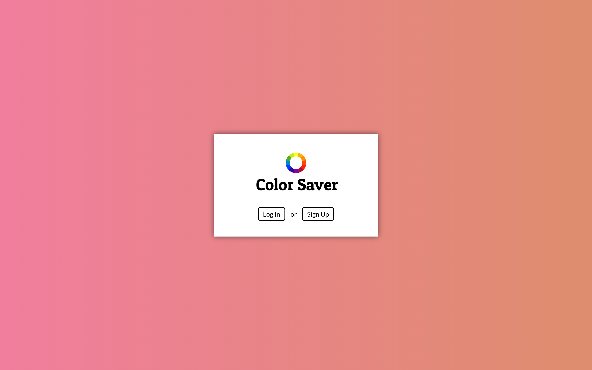
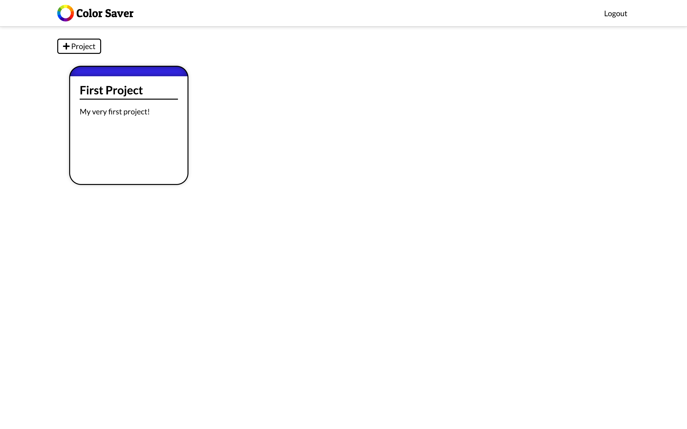
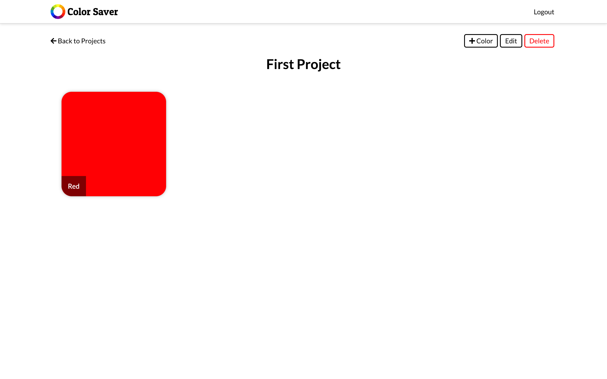

# Color Saver

Color Saver helps you stay organized while working on your latest design project. Save RGB or hexadecimal color values using Color Saver, so you'll have a quick reference to your palette, or revisit old projects when you are trying to remember a color that you loved.

## Getting Started

Link to live site: https://color-saver.herokuapp.com/

### Instructions

#### Authentication

##### Sign Up

If you have not yet created a Color Saver account, click the "Sign Up" button on the splash page. You will then be taken to a form where you can create your account with a username and password.

##### Log In

If you have already created a Color Saver account, click the "Log In" button and type in your username and password to access your projects and colors.

#### Projects

##### Create a New Project

To create a new project, click the "+ Project" button in the top left. This will take you to a form where you can enter details about your new project. A title is required but the description is optional. Inside your project, you will be able to create colors that belong to that project.

##### Edit a Project

After clicking on one of your existing projects, you will see an edit button at the top of the screen. Clicking this button will take you to a form where can change the details of your project. Title is still a required field, but the description is optional.

##### Delete a Project

A delete button will appear at the top of the screen after you click on one of your projects. Once you click this button, the project and all of the colors it has inside of it will be deleted forever.

#### Colors

##### Create a New Color

Once inside a project, You are given the choice to add a new color. After clicking the "+ Color" button at the top of the screen, you will be taken to a form for creating a new color. Both fields are required and the value field must be either a hexadecimal or RGB color value.

##### Edit a Color

You will be given the option to edit a color after clicking on one. When you click the edit button, you are taken to a form where you can change the name or value of your color. Both fields are required and the value field must be either a hexadecimal or RGB color value.

##### Delete a Color

After clicking on one of your colors, you will see a delete button under the color information. Clicking this button will delete the color from your project.

## Technologies Used

  1. Used [Node](https://nodejs.org/en/) and [Express](https://expressjs.com/) to create the server.
  2. Used [MongoDB](https://developers.google.com/youtube/v3/) to store data for users, projects, and colors.
  3. Used [Font Awesome](https://fontawesome.com/) for icons.
